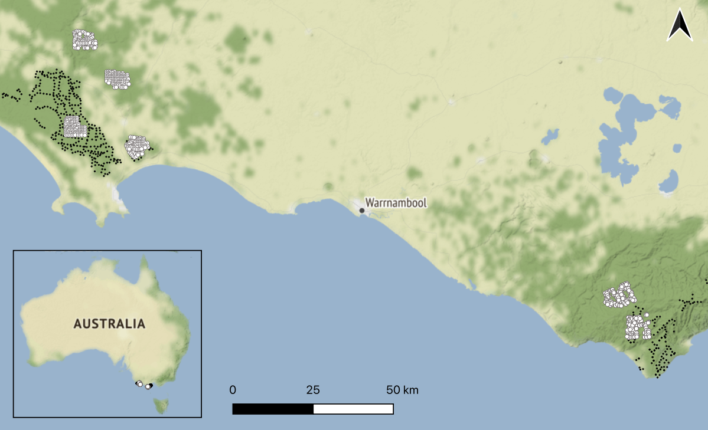

```{r setup, include = FALSE}
knitr::opts_chunk$set(
  echo      = FALSE,
  warning   = FALSE,
  message   = FALSE,
  error     = FALSE,
  cache     = FALSE,
  fig.path  = "../figs/",
  fig.align = "center",
  out.width = "80%")

library(kableExtra)
library(dplyr)
library(readr)
library(secr)
library(mgcv)            
library(tidyverse)
library(camtrapR)        
library(magick)
library(kableExtra)
library(RColorBrewer)    
library(patchwork)
library(viridis)         
library(sf) 
library(sp) 
library(terra)
library(lubridate)

#Set the default theme for ggplot objects to theme_bw()
theme_set(theme_bw())
theme_update(panel.grid = element_blank())

```

```{r density-load-prep-data, echo=FALSE}
# load camera-trap station info
records <- read.csv("/Users/ree140/Dropbox/personal/matt/github/phd-thesis/index/data/density/spp_records_pa.csv")
records_otways <- records[which(records$region == "otways"),] 
records_glenelg <- records[which(records$region == "glenelg"),]
# lower glenelg fox records
records_lg <- read.csv("/Users/ree140/Dropbox/personal/matt/github/phd-thesis/index/data/density/lower_glenelg_fox_pa.csv")
# load masks as dataframes (for covariates)
otways_mask_df <- readRDS("/Users/ree140/Dropbox/personal/matt/github/phd-thesis/index/data/density/otway_mask_df.RData")
glenelg_mask_df <- readRDS("/Users/ree140/Dropbox/personal/matt/github/phd-thesis/index/data/density/glenelg_mask_df.RData")
# load SECR capture histories - each session (but seperate unID from unmarked)
# mt clay (no black cats)
ch_mc <- readRDS("/Users/ree140/Dropbox/personal/matt/github/phd-thesis/index/data/density/ch_mc.RData")
unid_mc <- as.matrix(read.csv("/Users/ree140/Dropbox/personal/matt/github/phd-thesis/index/data/density/unid_mc.csv")[, -1]) 
mrch_mc <- addSightings(ch_mc, uncertain = unid_mc)
# hotspur 
ch_h <- readRDS("/Users/ree140/Dropbox/personal/matt/github/phd-thesis/index/data/density/ch_h.RData")
unid_h <- as.matrix(read.csv("/Users/ree140/Dropbox/personal/matt/github/phd-thesis/index/data/density/unid_h.csv")[, -1]) 
unm_h <- as.matrix(read.csv("/Users/ree140/Dropbox/personal/matt/github/phd-thesis/index/data/density/unm_h.csv")[, -1]) 
mrch_h <- addSightings(ch_h, unmarked = unm_h, uncertain = unid_h)
# annya 
ch_a <- readRDS("/Users/ree140/Dropbox/personal/matt/github/phd-thesis/index/data/density/ch_a.RData")
unid_a <- as.matrix(read.csv("/Users/ree140/Dropbox/personal/matt/github/phd-thesis/index/data/density/unid_a.csv")[, -1]) 
unm_a <- as.matrix(read.csv("/Users/ree140/Dropbox/personal/matt/github/phd-thesis/index/data/density/unm_a.csv")[, -1]) 
mrch_a <- addSightings(ch_a, unmarked = unm_a, uncertain = unid_a)
# cobbob 
ch_c <- readRDS("/Users/ree140/Dropbox/personal/matt/github/phd-thesis/index/data/density/ch_c.RData")
unid_c <- as.matrix(read.csv("/Users/ree140/Dropbox/personal/matt/github/phd-thesis/index/data/density/unid_c.csv")[, -1]) 
unm_c <- as.matrix(read.csv("/Users/ree140/Dropbox/personal/matt/github/phd-thesis/index/data/density/unm_c.csv")[, -1]) 
mrch_c <- addSightings(ch_c, unmarked = unm_c, uncertain = unid_c)
# LGNP north
ch_lgnpn <- read.capthist(captfile = "/Users/ree140/Dropbox/personal/matt/github/phd-thesis/index/data/density/LGNPN_caphist.txt", trapfile = "/Users/ree140/Dropbox/personal/matt/github/phd-thesis/index/data/density/LGNPN_traps.txt", detector = "proximity")
# LGNP south
ch_lgnps <- read.capthist(captfile = "/Users/ree140/Dropbox/personal/matt/github/phd-thesis/index/data/density/LGNPS_caphist.txt", trapfile = "/Users/ree140/Dropbox/personal/matt/github/phd-thesis/index/data/density/LGNPS_traps.txt", detector = "proximity")
# northern grid 2017 
ch_n_17 <- readRDS("/Users/ree140/Dropbox/personal/matt/github/phd-thesis/index/data/density/ch_n_17.RData")
unid_n_17 <- as.matrix(read.csv("/Users/ree140/Dropbox/personal/matt/github/phd-thesis/index/data/density/unid_n_17.csv")[, -1]) 
unm_n_17 <- as.matrix(read.csv("/Users/ree140/Dropbox/personal/matt/github/phd-thesis/index/data/density/unm_n_17.csv")[, -1]) 
mrch_n_17 <- addSightings(ch_n_17, unmarked = unm_n_17, uncertain = unid_n_17)
# northern grid 2018 
ch_n_18 <- readRDS("/Users/ree140/Dropbox/personal/matt/github/phd-thesis/index/data/density/ch_n_18.RData")
unid_n_18 <- as.matrix(read.csv("/Users/ree140/Dropbox/personal/matt/github/phd-thesis/index/data/density/unid_n_18.csv")[, -1]) 
unm_n_18 <- as.matrix(read.csv("/Users/ree140/Dropbox/personal/matt/github/phd-thesis/index/data/density/unm_n_18.csv")[, -1]) 
mrch_n_18 <- addSightings(ch_n_18, unmarked = unm_n_18, uncertain = unid_n_18)
# northern grid 2019 
ch_n_19 <- readRDS("/Users/ree140/Dropbox/personal/matt/github/phd-thesis/index/data/density/ch_n_19.RData")
unid_n_19 <- as.matrix(read.csv("/Users/ree140/Dropbox/personal/matt/github/phd-thesis/index/data/density/unid_n_19.csv")[, -1]) 
unm_n_19 <- as.matrix(read.csv("/Users/ree140/Dropbox/personal/matt/github/phd-thesis/index/data/density/unm_n_19.csv")[, -1]) 
mrch_n_19 <- addSightings(ch_n_19, unmarked = unm_n_19, uncertain = unid_n_19)
# southern grid 2017 
ch_s_17 <- readRDS("/Users/ree140/Dropbox/personal/matt/github/phd-thesis/index/data/density/ch_s_17.RData")
unid_s_17 <- as.matrix(read.csv("/Users/ree140/Dropbox/personal/matt/github/phd-thesis/index/data/density/unid_s_17.csv")[, -1]) 
unm_s_17 <- as.matrix(read.csv("/Users/ree140/Dropbox/personal/matt/github/phd-thesis/index/data/density/unm_s_17.csv")[, -1]) 
mrch_s_17 <- addSightings(ch_s_17, unmarked = unm_s_17, uncertain = unid_s_17)
# southern grid 2018 
ch_s_18 <- readRDS("/Users/ree140/Dropbox/personal/matt/github/phd-thesis/index/data/density/ch_s_18.RData")
unid_s_18 <- as.matrix(read.csv("/Users/ree140/Dropbox/personal/matt/github/phd-thesis/index/data/density/unid_s_18.csv")[, -1]) 
unm_s_18 <- as.matrix(read.csv("/Users/ree140/Dropbox/personal/matt/github/phd-thesis/index/data/density/unm_s_18.csv")  [, -1]) 
mrch_s_18 <- addSightings(ch_s_18, unmarked = unm_s_18, uncertain = unid_s_18)
# southern grid 2019 
ch_s_19 <- readRDS("/Users/ree140/Dropbox/personal/matt/github/phd-thesis/index/data/density/ch_s_19.RData")
unid_s_19 <- as.matrix(read.csv("/Users/ree140/Dropbox/personal/matt/github/phd-thesis/index/data/density/unid_s_19.csv")[, -1]) 
unm_s_19 <- as.matrix(read.csv("/Users/ree140/Dropbox/personal/matt/github/phd-thesis/index/data/density/unm_s_19.csv")[, -1]) 
mrch_s_19 <- addSightings(ch_s_19, unmarked = unm_s_19, uncertain = unid_s_19)
# combine capthists per region
mrch_glenelg <- MS.capthist(mrch_a, mrch_c, mrch_h, mrch_mc, ch_lgnpn, ch_lgnps)
mrch_otways <- MS.capthist(mrch_n_17, mrch_s_17, mrch_n_18, mrch_s_18, mrch_n_19, mrch_s_19)
mrch <- MS.capthist(mrch_a, mrch_c, mrch_h, mrch_mc, ch_lgnpn, ch_lgnps, mrch_n_17, mrch_s_17, mrch_n_18, mrch_s_18, mrch_n_19, mrch_s_19)
# load masks
masks <- readRDS("/Users/ree140/Dropbox/personal/matt/github/phd-thesis/index/data/density/masks.RData")
# load SECR models
df_fits_glenelg <- readRDS("../models/glenelg_df_fits.RData")
glenelg_fits <- readRDS("../models/glenelg_fits.RData")
glenelg_set1 <- readRDS("../models/glenelg_set1.RData")
glenelg_set2 <- readRDS("../models/glenelg_set2.RData")
glenelg_set3 <- readRDS("../models/glenelg_set3.RData")
df_fits_otways <- readRDS("../models/otways_df_fits.RData")
otways_fits <- readRDS("../models/otways_fits.RData")
otways_set1 <- readRDS("../models/otways_set1.RData")
otways_set2 <- readRDS("../models/otways_set2.RData")
otways_set3 <- readRDS("../models/otways_set3.RData")
# load GAMs
gam_g_fox <- readRDS("../models/gam_g_fox.RData")
gam_o_fox <- readRDS("../models/gam_o_fox.RData")
```

\parskip=12pt

\newpage

# ABSTRACT {.unnumbered}

1.  The mesopredator release theory predicts that the density of subordinate predators will increase as dominant predators decline. Persistent debate around mesopredator release in part reflects the lack of robust, replicated experiments to test this theory, and the use of population indices which confound changes in mesopredator density and detectability. This uncertainty has immediate impacts for conservationists who are faced with managing sympatric invasive predators.

2.  We used replicated experimental designs and spatially-explicit models to examine whether mesopredator release of the feral cat *Felis catus* occurs in response to targeted control of the introduced red fox *Vulpes vulpes*. We surveyed three Control-Impact paired landscapes in a region with long-term fox control (1080 poison baiting), and conducted a Before-After Control-Impact Paired-Series experiment in another region. We used fox occurrence as a simple metric of fox populations and estimated feral cat density with spatial mark-resight models.

3.  Lethal fox control had varying effects on fox occurrence, consistent with variation in the duration and intensity of poison baiting. Correspondingly, responses in feral cat density ranged from negligible to a 3.7-fold higher density in fox-baited landscapes. At a fine spatial scale (200 m^2^), feral cat density was negatively associated with fox occurrence probability across both regions. These results were consistent with mesopredator release, although uncertainty was high in the region where fox control had only recently commenced.

4.  Feral cat detectability also varied across the (artificially-manipulated) gradients of fox occurrence probability. In one region, nonlinear models indicated that feral cats had lower detection and increased movement rates when foxes were uncommon, giving way to density suppression at high fox occurrence probabilities.

5.  *Synthesis and applications.* Our study provides replicated, experimental evidence that dominant predator suppression can be associated with a higher mesopredator density. Mesopredator release can manifest as changes in both behaviour and density, distorting inference if these processes are not distinguished. Our results may help explain why fox control does not consistently improve native prey persistence, suggesting integrated pest management may be necessary to improve conservation outcomes.


# INTRODUCTION

Understanding species interactions is critical for effective invasive species management [@zavaleta2001viewing]. Where several invasive species co-occur, management actions that suppress the dominant invasive species may inadvertently benefit subordinate invasive species [@jackson2015interactions]. For example, the removal of a dominant invasive predator may increase the density of subordinate invasive predators directly by reducing top-down pressure, or indirectly by increasing the availability of shared resources; often referred to as mesopredator release [@soule1988reconstructed; @prugh2009rise]. The release of subordinate invasive predators can have serious negative implications for native taxa and ecosystem function [@doherty2017stop; @takimoto2022simple]. However, integrated invasive predator management is often far more costly and less feasible than single species control, and so it is important to identify when the extra cost is justified [@bode2015eradicating].

Most knowledge of mesopredator release stems from unreplicated 'natural experiments' [e.g., range contractions - @crooks1999mesopredator] or ad-hoc management interventions [e.g., invasive species eradications - @rayner2007spatial] where dominant predators have become largely absent from the system. It is particularly unclear whether mesopredator release still occurs when dominant predators are suppressed but not completely removed. The occurrence, nature (positive or negative, direct or indirect) and strength of predator interactions can vary among species assemblages, environmental productivity, management regimes and other landscape contexts [@finke2004predator; @ritchie2009predator; @baum2009cascading]. Replicating management programs in an experimental framework is logistically challenging, but important for understanding these complexities, discriminating between plausible hypotheses and producing generalisable results to inform effective pest management [@glen2005complex; @ford2015trophic].

Another source of uncertainty around the mesopredator release hypothesis stems from the inability of traditional survey and modelling approaches to distinguish behavioural from numerical population processes [@hayward2015ecologists; @anderson2001need]. Suppression of a dominant predator may simultaneously change the behaviour and the density of a mesopredator, both of which influence detection rates [@broadley2019density]. This makes it difficult to interpret observed changes in naïve indices of mesopredator activity or occurrence in relation to changes in dominant predator populations, even if the study has an experimental design. Unbiased estimates of invasive predator density are also important for setting meaningful control targets and inferring impacts on native prey [@moseby2019understanding]. Spatial capture-recapture methods offer a solution by separating behavioural and observational processes from population density, estimated within a defined spatial unit [@gardner2009hierarchical].

Predation by two invasive species, the red fox *Vulpes vulpes* (hereafter 'fox') and feral cat *Felis catus* (hereafter 'cat'), has played a major role in Australia's high rates of mammalian extinction [@woinarski2015ongoing]. Integrated pest management programs are rare; instead, foxes are far more commonly controlled than cats, as they are more susceptible to poison baiting, have greater direct economic impacts and fewer legal impediments to control [@reddiex2007control; @mcleod2014fertility]. Nonetheless, cats are one of the most widespread and damaging vertebrate predator species [@doherty2017impacts; @medina2011global; @legge2020cat]. As foxes are larger-bodied and have high dietary overlap with cats [@fleming2022distinctive], the mesopredator release hypothesis [@soule1988reconstructed] predicts cat density will increase as fox populations are suppressed [@molsher2017mesopredator]. Mesopredator release of cats would likely dampen the conservation benefits of fox control, and could even worsen outcomes for some native prey species [@takimoto2022simple], as has previously been suspected [e.g., @wayne2017recoveries].

Evidence that foxes suppress cats is inconclusive. In parts of Australia where the apex mammalian predator (the dingo *Canis familiaris*) is locally extinct and introduced foxes are the largest terrestrial mammalian predator, four studies found that fox control was associated with higher cat detection rates [@risbey2000impacts; @marlow2015cats; @norton2015population; @stobo2020management]. However, two other studies in similar systems did not see any change [@towerton2011detecting; @molsher2017mesopredator]. A further study with spatial replication detected an increase at one site but not another [@davey2006exotic], and another observed a decrease in cat activity [@claridge2010trends]. No prior studies have directly estimated changes in cat density in response to fox control. More reliable and standardised population measurements need to be deployed across different landscapes to understand what factors drive the variable responses of cats to dominant predator control [@hayward2015ecologists].

We experimentally investigated the role of introduced foxes in top-down suppression of cat density across eight landscapes within two regions of south-eastern Australia. Our experiment had a replicated Control-Impact design in the region with long-term fox control, and a Before-After Control-Impact Paired-Series (BACIPS) design in the region with newly implemented fox control. Foxes and cats are the only terrestrial mammalian predators in these regions heavier than one kilogram. Each region included at least one area in which foxes were subject to continuous lethal poison baiting (hereafter 'impact landscape'), and a paired area where foxes were not controlled (hereafter 'non-impact landscape'). This allowed focus on the associations between the two invasive predators, across an artificially-manipulated gradient of dominant predator (fox) occurrence probability. In accordance with mesopredator release theory, we predicted that: (1) fox control would be associated with higher cat densities at the landscape-scale, and (2) cat density would be negatively correlated with fox occurrence probability at a fine spatial scale (which could help explain cat responses to fox control). We based inference on direct estimates of cat density using spatially explicit mark-resight models.

\newpage

# MATERIALS AND METHODS

## Study area
We conducted our study across two regions of south-west Victoria, Australia (Fig. \@ref(fig:density-map)). The native temperate forests in both regions are fragmented to varying degrees, primarily by livestock farming and timber plantations. Dingoes are now absent throughout southwest Victoria [@cairns2018elucidating]. A native mesopredator, the tiger quoll *Dasyurus maculatus* is long absent from the Glenelg region and extremely rare in the Otway Ranges (last sighted in 2014 despite extensive camera-trapping). The terrestrial mammalian predator guild is therefore depauperate, with foxes and cats being the primary mammalian terrestrial predators heavier than one kilogram; birds of prey and snakes are the only other medium-large carnivores present.

Our study landscapes in the Glenelg region were primarily lowland forest and heathy woodland [@delwp2020bioregions]. The area receives an average annual rainfall of 700 mm [@BOM2021, Cashmore Airport] and has gently undulating terrain. The region frequently experiences prescribed burns and wildfires, creating a mosaic of fire histories and vegetation complexity. Our study landscapes in the Otway region were in the western section of the Otway Ranges. Rainfall here is more than twice as high as the Glenelg region [@BOM2021, Cape Otway]. The vegetation is a mosaic of shrubby wet forest and cool temperate rainforest, with the northern landscape bordering on a large heathy woodland [@delwp2020bioregions]. This region rarely experiences fire and is nearly ten times more rugged than the Glenelg region [based on the terrain ruggedness index, @riley1999index].

Government land managers conduct ongoing targeted fox control for biodiversity conservation across broad landscapes within each region (detailed in Section 2.2 below). In these landscapes, manufactured poison baits ('FoxOff', Animal Control Technologies, Somerton) containing 3 mg of sodium fluroacetate (compound 1080) are buried at a depth of 12 - 15 cm at 1-km intervals along accessible forest tracks and roads (Fig. \@ref(fig:density-map)). Different road densities across the two regions result in variable poison bait densities. Other large sections within each region are maintained without fox control.


## Study design and camera-trapping
We designed experiments around the implementation of fox-baiting in each region. We simultaneously surveyed one impact and one non-impact landscape at a time. Each pair of impact and non-impact landscapes were chosen based on similarity in vegetation groups, while aiming to maximise spatial independence with respect to predator daily movements.

In the Glenelg region, we used a spatially replicated Control-Impact design to compare three impact landscapes that had been poison baited for foxes at fortnightly intervals for more than 13 years with three paired non-impact landscapes. The pairing of these landscapes was based on similarities in vegetation classes, and specified in the original design of the Glenelg Ark monitoring program [@robley2014long]. We surveyed Cobboboonee National Park (impact) and Annya State Forest (non-impact) in January -- April 2018 ('replicate 1'), Mt Clay State Forest / Narrawong Flora Reserve (hereafter 'Mt Clay'; impact) and Hotspur State Forest (non-impact) in April -- June 2018 ('replicate 2'), and Lower Glenelg National Park (LGNP) South (impact) and LGNP North (non-impact) in March -- May 2021 ('replicate 3'). For replicates 1 and 2, the paired landscapes were separated by at least 8 km, a distance unlikely to be frequently traversed regularly by these invasive predators [@hradsky2017human]. Lower Glenelg National Park South and North are separated by the Glenelg River, which is unlikely to be regularly crossed by most terrestrial animals.

In the Otway region, we used a Before-After Control-Impact Paired-Series (BACIPS) design to assess changes related to the introduction of a fox control program. We deployed camera-trap grids in a pair of impact -- non-impact landscapes from June to September in three years (2017, 2018, 2019), in the Great Otway National Park and Otway Forest Park. Our first survey occurred approximately three months before fox-baiting began. Fox-baiting commenced for the first time in the impact landscape in November 2017. Poison baits were replaced weekly for six weeks until December 2017, before changing to monthly bait replacement until July 2018. The second survey was conducted six months after fox-baiting commenced, however poison bait replacement ceased from near the beginning of the survey until nearly three months afterwards. Fox-baiting at monthly intervals recommenced in December 2018, six months prior to the start of the final survey (Supporting Information Fig. \@ref(fig:density-camop)). The impact ('South') and non-impact ('North') landscapes were at least 4.2 km apart through dense forest. In this study, and a concurrent study which identified individual foxes through genetic sampling [@le2022genetic], we found no evidence that either foxes or cats moved between the impact and non-impact landscapes.

In each landscape, we established an irregular grid of 49 -- 110 sites (mean: 88). We broadly aimed to space camera-traps 500 m apart, but randomly varied distances from 194 -- 770 m (mean spacing: 448 m) to achieve an irregular spacing design [@rich2019sampling]. Larger 'holes' in the camera-trap grids were due to accessibility constraints. We situated each site in the forest interior, at least 30 m from roads and tracks. At each site, we set up a Reconyx (Holmen, Wisconsin) infrared camera-trap on a tree, facing a tuna oil lure (Supporting Information \@ref(density-app-field); Fig. \@ref(fig:density-cam-photo); Table \@ref(tab:cam-models)). Overall, we deployed 1,051 functional camera-traps, which operated for an average of 65 days (range: 12 -- 93 days), totalling 68,504 trap nights (Table \@ref(tab:tab-dates)). Surveys were conducted under approval from the University of Melbourne Animal Ethics Committee (ref: 1714119) and Victorian Government (ref: 10008273)

## Individual feral cat identification
We sorted the camera-trap images of cats into five categories based on coat type (Supporting Information Fig. \@ref(fig:density-cat-photo)), and identified individual feral cats within each category; see Supporting Information \@ref(density-app-id) for details. In the Otway region, 40% of cat detections were of black cats with few identifiable markings, so we did not attempt to identify any black cats here. In the Glenelg region, black cats were rarer (not detected at two landscapes) and often more distinctive, and so we could identify some individuals (Table \@ref(tab:tab-dates)).


## Fox spatial occurrence {#density-methods-fox}
To (i) investigate effects of poison-baiting on foxes, (ii) test for negative correlations between foxes and cat density and (iii) account for potential effects of foxes on cat detectability, we modelled fine-scale and spatially-explicit fox occurrence probabilities. We used fox occurrence probability as a simple metric of fox populations in lieu of simultaneous, reliable fox density estimates. Foxes are not individually identifiable from camera-trap images [@guthlin2014possible] and, while density estimates can be derived from unmarked populations, their reliability remains questionable [@barker2018reliability; @sun2022cautionary]. We modelled fox occurrence probabilities (from presence-absence records) rather than detection counts as we considered this more conservative: a greater change in fox density is likely required to alter occurrence. In some circumstances, predator occurrence probability scales with population density [e.g., @linden2017examining], although this remains unknown in our study.

We could not use raw fox presence-absence data from the camera-traps as a response variable for cat density as spatial mark-resight models require covariate values for each grid cell in which density is estimated (see Section \@ref(density-methods-smr)). Instead, we generated a spatially-interpolated layer of the probability of fox occurrence for each study landscape, using fox presence-absence data for each camera-trap site and binomial generalised additive mixed-effects models [@wood2017generalized]. These models allow efficient nonlinear spatial estimates, but do not account for imperfect detection. Nonetheless, naïve fox occurrence probabilities may relate to how cats perceive the risk of fox encounter for the survey duration.

We built fox occurrence models using the 'mgcv' R-package [version 1.3.1, @wood2011fast]. We modelled fox presences and absences (response variable) across space (explanatory variable) separately for each region, with a duchon spline spatial smooth [which provide better predictions at the edge of surveyed space than other splines, @miller2014finite]. In the Otway region, we included a random intercept for each camera-trap site to account for repeat sampling and did not share spatial information across years. Differences in camera-trap deployment lengths were accounted for using a model offset.


## Spatial mark-resight models of feral cat density {#density-methods-smr}
We used a spatial capture-recapture approach to estimate cat density [@gardner2009hierarchical]. These models use counts of detections and non-detections of individual animals at trap locations (accounting for trap-specific survey effort) to estimate the location of each individual's activity centre. They commonly assume that individuals have approximately circular home ranges, spend the majority of time in the centre of their range ('activity centre'), and that the probability of observing an individual decreases with distance from the activity centre. Two detectability parameters govern this process: *g*~0~, the probability of detecting an individual per occasion in their activity centre, and *sigma*: a spatial scale parameter which relates to home range size. Multiple candidate shapes for the decline in detectability with distance from the activity centre ('detection function') can be modelled, although half-normal and exponential are most commonly used. Spatial capture-recapture models have been extended to consider situations where not all individuals in a population are identifiable [i.e., some are unmarked, @efford2018spatial]. These models typically assume unmarked individuals to be a random sample of the population, sharing the same detection process as marked individuals, allowing density to be estimated for the entire population.

We used sighting-only spatial mark-resight models to estimate cat density using the maximum likelihood 'secr' R-package [version 4.4.4, @efford2021secr]. We used closed population models as open population spatial mark-resight models have not yet been developed. Detections of the 'mark status uncertain' category (unidentifiable cats), cannot be handled in the 'secr' R package; we added them to as 'unmarked' detections (black cats) rather than discard them [following @moseby2020effectiveness]. We condensed unmarked detection histories to a binary presence-absence record per each camera-trap for a 24-hour length duration ('occasion'), beginning at midday. We ran separate models for each region and treated each camera-trap grid deployment as a 'session' within the region-specific model. We created a 4000-m buffer zone around each site (which was truncated by the river in LGNP), and estimated cat density at a 200-m grid cell resolution within this area. These habitat mask specifications were based on initial model trials and our knowledge of cat behaviour in these regions; the aim was to ensure density was estimated over a large enough area to encompass the activity centres of all cats exposed to our camera-traps, at a fine enough spatial scale to minimise bias in density estimates.

For each region, we ran four sets of models. We (1) chose between half-normal and exponential detection functions and (2) chose 'base model' covariates to carry through to subsequent model sets. We then (3) evaluated the effect of fox control on cat density at the landscape scale with traditional experimental approaches (prediction 1), and (4) tested for associations between fox occurrence probabilities and cat density at a fine spatial scale (prediction 2). To choose between competing model specifications, we used small-sample corrected Akaike Information Criterion (hereafter 'AIC~c~') scores [@burnham2004multimodel]; carrying forward or presenting the top-ranked model (i.e., model with the lowest AIC~c~ score). In addition to examining confidence intervals around estimated model coefficients, we also used AIC~c~ scores to assess statistical evidence; models within two AIC~c~ units are generally considered equivalent in terms of predictive power [@burnham2004multimodel]. Steps two to four are described in more detail below.

The second set of models (base models) established the base covariates for each region. We hypothesised that cat detectability might decrease over each survey due to the scent of the tuna oil lure fading. To account for this, we modelled a nonlinear trend in *g*~0~ over the survey duration for each camera-trap. We also used a range of camera-trap models which could have impacted detection rates (Table \@ref(tab:cam-models)). We tested whether camera-trap model impacted cat detection rates in the Otways, but not the Glenelg region as 97% of cameras here were the HC600 model [3% were the PC900 model which primarily differ only in software settings, @seidlitz2020optimising], using camera-trap model as a categorical variable (n = 5) on *g*~0~. We further hypothesised that cat density might differ between vegetation types. We classed the vegetation into three dominant types for each region: cleared land, heathy vegetation, and either dry forest (Glenelg region) or wet forest (Otway region); see Supporting Information \@ref(density-app-veg), Fig. \@ref(fig:density-veg), for details. We compared these covariates as single and additive models, as well as to a 'null model' (density and detectability constant), and carried the supported covariates forward to subsequent model sets.

The third set of models inferred the effects of fox-baiting on cat density at a landscape scale within each region using traditional experimental designs (prediction 1). We fitted models which estimated cat density separately for each landscape, and used AIC~c~ scores to choose whether to model detectability as a function of predicted fox occurrence probability or constant. For the top-ranked model, we then calculated the estimated difference in cat density between paired landscape surveys (via the 'contrasts' argument in the 'secr.fit' function). We assessed the weight of statistical evidence using confidence intervals of the estimated difference and a p-value threshold of 0.05. In CI experiments (Glenelg region), a p-value below 0.05 is achieved when the 95% confidence interval of the estimated difference between the two independent samples does not cross zero on the natural logarithmic scale [@cumming2005inference]. We repeated this confidence interval assessment three times in the Glenelg region, once for each spatially replicated landscape pair. In 'repeated measures' designs such as BACI experiments (Otway region), changes in successive estimates of difference provide inference of an effect [@cumming2005inference]; here a p-value below 0.05 is approximately reached once 83% confidence intervals do not overlap each other [@goldstein1995graphical; @austin2002brief]. We therefore assessed whether the 83% confidence interval of the estimated difference between the Otway region paired landscapes in 2017 (before fox control) overlapped the respective 83% confidence interval of the estimated difference in 2018 (approximately six months after fox control first commenced), as well as in 2019 (approximately 18 months after fox control first commenced).  

The fourth set of models directly tested the associations between fine-scale fox occurrence and cats within each region (prediction 2). We tested three models where (i) fox occurrence probability affected cat density, (ii) fox occurrence probability affected cat detectability [both *g*~0~ and *sigma* concurrently, @efford2014compensatory], (iii) fox occurrence probability affected both the density and the detectability of cats, against the null model with no association between fox occurrence and cats. We used the spatial fox occurrence probability estimates (detailed in Section \@ref(density-methods-fox)) as the explanatory variable. As predator associations may be nonlinear [@johnson2009evidence], we tested these effects as linear and nonlinear terms using regression splines (generalised additive models called within the 'secr' R-package). We included year as a cat density covariate in all the Otway region models to account for repeat sampling. A limitation of this approach is that uncertainty from fox occurrence probability models was not propagated into the spatial mark-resight models - a full Bayesian integration of the fox occurrence analysis and the spatial mark-resight model to address this is not yet implemented.

\newpage

```{r density-map, out.width="100%", fig.cap = "Locations of our eight study landscapes in south-west Victoria, Australia (red outlines)Z. Locations of fox poison bait stations are denoted by black dots. The Glenelg region is to the west and Otway region to the east. Native vegetation is indicated by dark green, with hill shading. \\textit{Map tiles by Stamen Design, under CC BY 3.0, map data by OpenStreetMap, under CC BY SA.}"}

```

\newpage

# RESULTS

## Glenelg region

### Red Fox
In the Glenelg region, foxes were detected at 48 -- 57% of sites (i.e., naïve occupancy) within the three non-impact (unbaited) landscapes (Table \@ref(tab:tab-dates)). Naïve occupancy rates were more than two and three times lower in the paired impact (poison baited) landscape for replicates 1 and 3, respectively, but only 27% lower in replicate 2 (Table \@ref(tab:tab-dates)). The fox spatial occurrence probability model explained 13.1% of the null deviance, with an adjusted R-squared value of 0.13 (spatial standard error estimates are shown in Supporting Information Fig.  \@ref(fig:density-fox-se-g)). The fox occurrence model highlighted fine-scale variation in fox occurrence probabilities within landscapes (for example, fox occurrence probability was low in the centre of Mt Clay, but higher closer to the forest edge) and demonstrated a strong effect of the Glenelg River in separating fox populations in the Lower Glenelg National Park landscapes (Fig. \@ref(fig:foxplot)).

### Feral cat
Across the six landscapes in the Glenelg region, we recorded 251 cat detections from 32,232 camera-trap nights (Table \@ref(tab:tab-dates)). We were able to identify 64% of cat detections to the individual-level; a total of 67 cats (6 -- 13 individuals per landscape; Supporting Information Fig. \@ref(fig:density-plot-ch-1); \@ref(fig:density-plot-ch-2); \@ref(fig:density-plot-ch-3)). The exponential detector function was supported over the half-normal function (Table \@ref(tab:density-aic-g-1)). The null model was marginally supported over models with vegetation impacts on cat density and linear time trends on *g*~0~ (Supporting Information Table \@ref(tab:density-aic-g-2)).

Our prediction (1) that cat density would be higher in landscapes with fox control was supported for the first and third spatial replicates: estimated cat densities were 2.5 (95% CI: 1.5 - 4.2) and 3.7 (95% CI: 1.4 - 9.5) times higher in the impact landscape than the paired non-impact landscape, respectively (Fig. \@ref(fig:diffg)). There was no difference in cat density between landscape pairs in the second spatial replicate (1.1; 95% CI: 0.69 - 1.69; Fig. \@ref(fig:diffg)); this pair also had the smallest difference in naïve fox occupancy occurrence rates (Table \@ref(tab:tab-dates)). At the landscape-level, there was little evidence that cat detectability was associated with fox occurrence; although this model ranked more highly than the constant detectability model (Supporting Information Table \@ref(tab:density-aic-g-4)), the difference in AICc scores was only 0.95 units and the estimated effects were weak with high uncertainty, i.e., detectability (*g*~0~): 0.24 (95% CI: -0.32 - 0.80); movement (*sigma*): 0.13 (95% CI: -0.14 - 0.41).

Our prediction (2) that cat density would be negatively correlated with fox occurrence probability at a fine spatial scale was supported (4.26 AIC~c~ units better than the null; Supporting Information Table \@ref(tab:density-aic-g-3)). The top-ranked model indicated that cat density declined as the probability of fox occurrence increased (-0.32; 95% CI: -0.57 - -0.07; Fig. \@ref(fig:dcor)), and that there was no association between fox occurrence and cat detectability (Supporting Information Table \@ref(tab:density-aic-g-3)). Nonlinear regression splines added additional model parameters without changing predictions (Fig. \@ref(fig:dcor)); all nonlinear models ranked below their linear counterparts (Supporting Information Table \@ref(tab:density-aic-g-3)).


## Otway region

### Red fox
In the Otway region, the probability of fox occurrence declined by 43% over three years in the impact landscape, and increased by 22% in the non-impact landscape (where they were not lethally controlled) over the same period (averaged at each camera-trap site in the landscape; Fig. \@ref(fig:foxplot)b). Fox occurrence probability in the Otway region was generally lower than the Glenelg region and had less fine-scale spatial variation. For example, fox occurrence was predicted to be spatially consistent across the entire Otway region in 2018 (i.e., fox occurrence probability was the same in both the impact and non-impact landscape, Fig. \@ref(fig:foxplot); as were naïve occupancy rates, Table \@ref(tab:tab-dates)). The fox spatial occurrence model explained 27.8% of the null deviance, with an adjusted R-squared value of 0.24 (spatial standard error estimates are shown in Supporting Information Fig. \@ref(fig:density-fox-se-o)).

### Feral cat
In the Otway region, we recorded 970 cat detections from 36,272 camera-trap nights (Table \@ref(tab:tab-dates)). We were able to identify 53% of cat detections to the individual-level; a total of 93 cats (20 -- 30 individuals per camera-trap grid deployment, with some individual detected in multiple years, Supporting Information Fig. \@ref(fig:density-plot-ch-4); \@ref(fig:density-plot-ch-5); \@ref(fig:density-plot-ch-6)). The exponential detector function was strongly supported over the half-normal function (Table \@ref(tab:density-aic-o-1)). The null model was more strongly supported than the models with vegetation impacts on cat density, or camera-trap model or linear time trends on *g*~0~ (Table \@ref(tab:density-aic-o-2)).

Our prediction (1) that fox control would be associated with higher cat densities was supported in 2019 (\~1.5 years after fox baiting commenced), but not 2018 (six months after fox-baiting commenced, and during a break in the baiting program). Within each year, there was no statistical evidence that cat densities differed between the impact and non-impact landscapes (95% confidence intervals overlapped zero; Fig. 4a). However, a consistent upward trend in cat density in the impact landscape over three years and a simultaneous downward trend in the non-impact landscape (Fig. \@ref(fig:diffo)a), meant that there was a significant increase in cat density in the impact landscape 1.5 years after fox-baiting commenced, relative to changes in the non-impact landscape (i.e., 83% CIs for the estimated difference for 2017 and 2019 do not overlap; Fig. \@ref(fig:diffo)b). There was strong evidence that cat detectability was associated with fox occurrence probability (Supporting Information Table \@ref(tab:density-aic-o-4)), detailed below.

Our prediction (2) that cat density would be negatively correlated with fox occurrence probability at a fine spatial scale had some support. The top-ranked model included a negative linear association between cat density and fox occurrence, supporting our prediction. However, statistical evidence was weak: this model had similar predictive performance to a model without the association between cat density and fox occurrence probability (dAIC~c~ = 0.80; Table \@ref(tab:density-aic-o-3)). In addition, the 95% confidence interval around the linear coefficient from the top-ranked model marginally overlapped zero (-0.26; 95% CI: -0.55 - 0.02). The nonlinear version of this model also marginally ranked above the null model (dAIC~c~ = 0.47; Table \@ref(tab:density-aic-o-3)). This nonlinear model predicted that cat density only declined (at a steeper rate) in the mid-high range of fox occurrence probability (greater than \~0.25 on the response scale; Fig. \@ref(fig:dcor)).

There was strong support for an effect of fox occurrence probability on cat detectability at a fine spatial scale (Fig. \@ref(fig:detcor); Supporting Information Table \@ref(tab:density-aic-o-4)). Where fox occurrence probability was higher, cats were less detectable in their activity centres (i.e., negative association with *g*~0~; -0.69; 95% CI: -1.11 - -0.27; Fig. \@ref(fig:detcor)a) and ranged further (i.e., positive association with *sigma*; coefficient 0.30; 95% CI: 0.13 - 0.47; Fig. \@ref(fig:detcor)b). The equivalent nonlinear model predicted that detectability changes occurred only in the low-mid range of fox occurrence probabilities (less than \~0.25 on the response scale; Fig. \@ref(fig:detcor)).


```{=tex}
\newpage
\blandscape
```

```{r tab-dates}
# table of start / end dates for each grid

# clean LGNP records for merge
# add grid 
records_lg$st_no <- records_lg$station
records_lg$st_no <- as.integer(gsub('LGNP', "", records_lg$st_no))
records_lg$grid  <- if_else(records_lg$st_no >= 65, "LGNP North", "LGNP South")
# add station_year
records_lg$station_year <- paste0(records_lg$station, "_2021")
## merge LGNP records with other records
records <- bind_rows(records, records_lg)

# add grid / landscape variable 
records$grid  <- if_else(grepl("^A", records$station), "Annya", records$grid)
records$grid  <- if_else(grepl("^C", records$station), "Cobboboonee", records$grid)
records$grid  <- if_else(grepl("^H", records$station), "Hotspur", records$grid)
records$grid  <- if_else(grepl("^M", records$station), "Mt Clay", records$grid)
records$grid  <- if_else(grepl("^T", records$station), "South", records$grid)
records$grid  <- if_else(grepl("^U", records$station), "North", records$grid)
records$grid <- if_else(as.character(records$region) == "otways", paste0(records$grid, "_", records$year), records$grid)

# clean and summarise
df <- records %>% 
  group_by(grid) %>% 
  mutate(region = tools::toTitleCase(region),
         year = substr(station_year, nchar(station_year) - 3, nchar(station_year)), 
         date_min = min(ymd(date_start)),
         date_max = max(ymd(date_end)),
         duration = (ymd(date_max) - ymd(date_min)) - 1,
         cameras = n(),
         trap_nights = sum(survey_duration),
         fox_present = sum(fox),
         fox_naive = round(sum(fox) / n(), digits = 2)) %>% 
  distinct(grid, .keep_all = TRUE) %>% 
  select(region, grid, year, date_min, date_max, duration, cameras, trap_nights, fox_present, fox_naive)  %>%      
  arrange(region, date_min) 

## z-test
# get vals
g1 <- c(x = df$fox_present[1:2],   n = df$cameras[1:2])
g2 <- c(x = df$fox_present[3:4],   n = df$cameras[3:4])
g3 <- c(x = df$fox_present[5:6],   n = df$cameras[5:6])
o1 <- c(x = df$fox_present[7:8],   n = df$cameras[7:8])
o2 <- c(x = df$fox_present[9:10],  n = df$cameras[9:10])
o3 <- c(x = df$fox_present[11:12], n = df$cameras[11:12])
# run test
z_g1 <- round(as.numeric(unlist(prop.test(x = c(g1[1], g1[2]), n = c(g1[3], g1[4]), p = NULL, "two.sided", correct = TRUE)[3])), digits = 5)
z_g2 <- round(as.numeric(unlist(prop.test(x = c(g2[1], g2[2]), n = c(g2[3], g2[4]), p = NULL, "two.sided", correct = TRUE)[3])), digits = 5)
z_g3 <- round(as.numeric(unlist(prop.test(x = c(g3[1], g3[2]), n = c(g3[3], g3[4]), p = NULL, "two.sided", correct = TRUE)[3])), digits = 5)
z_o1 <- round(as.numeric(unlist(prop.test(x = c(o1[1], o1[2]), n = c(o1[3], o1[4]), p = NULL, "two.sided", correct = TRUE)[3])), digits = 5)
z_o2 <- round(as.numeric(unlist(prop.test(x = c(o2[1], o2[2]), n = c(o2[3], o2[4]), p = NULL, "two.sided", correct = TRUE)[3])), digits = 5)
z_o3 <- round(as.numeric(unlist(prop.test(x = c(o3[1], o3[2]), n = c(o3[3], o3[4]), p = NULL, "two.sided", correct = TRUE)[3])), digits = 5)
# add to df 
df$p_val <- c(z_g1, z_g1, z_g2, z_g2, z_g3, z_g3, z_o1, z_o1, z_o2, z_o2, z_o3, z_o3)

## add cats
# transpose summaries as a dataframe and bind together
g <- t(as.data.frame(summary(mrch_glenelg, terse = TRUE, moves = TRUE))) 
o <- t(as.data.frame(summary(mrch_otways, terse = TRUE, moves = TRUE)))
go <- as.data.frame(rbind(g,o))
go <- tibble::rownames_to_column(go, "grid")
# add other detections
go$Unidentified_detections <- c(3,  9,  3,  5, 0, 0,  8, 4, 12, 17, 22, 23)
go$Unmarked_detections     <- c(20, 37, 13, 0, 0, 0, 46, 48, 62, 59, 101, 58)
go$Total_detections <- go$Detections + go$Unidentified_detections + go$Unmarked_detections
# change name of grids
new_grid_names <- c(mrch_a = "Annya", mrch_c ="Cobboboonee", mrch_h = "Hotspur", mrch_mc = "Mt Clay", ch_lgnpn = "LGNP North", ch_lgnps = "LGNP South", mrch_s_17 = "South_2017", mrch_n_17 = "North_2017", mrch_s_18 = "South_2018", mrch_n_18 = "North_2018", mrch_s_19 = "South_2019", mrch_n_19 = "North_2019")
go$grid <- as.character(new_grid_names[go$grid])
# add to df
df <- left_join(df, go, by = "grid")

# add replicate col (pair)
df$replicate <- c("1", "1", "2", "2", "3", "3", "1", "1", "2", "2", "3", "3")

# add impact / non-impact (need to flip LGNP to be consistent) and reorder
df$treatment <- c(rep(c("non-impact", "impact"), 2), rep(c("impact", "non-impact"), 4))

## relocate
df1 <- df %>% 
  ungroup() %>% 
  arrange(region, replicate, treatment)  %>% 
  transmute(Region = region, 
            Landscape = if_else(region == "Otways", substr(grid, 1, nchar(grid) - 5), grid),
            Replicate = replicate, 
            Treatment = treatment, 
            "Start date" = date_min, 
            "End date" = date_max, 
            "Camera-traps" = cameras,
            "Trap-nights" = trap_nights,
            "Naïve occupancy" = fox_naive,
            Individuals = Animals,
            Moves,
            "Prop. unidentified" = round(Unidentified_detections / Total_detections, digits = 2),
            "Prop. unmarked " = round(Unmarked_detections / Total_detections, digits = 2), 
            "Total detections" = Total_detections)


df1$Region <- if_else(duplicated(df1$Region), "", df1$Region)

kbl(df1, booktabs = TRUE, 
    linesep = "",
   # col.names = c("Landscape", "Cameras", "Trapnights", "Cats", "Moves", "Identified", "Unidentified", "Unmarked"),
    caption = "Summary of experimental camera-trap surveys and invasive predator detections in the Glenelg and Otway regions, Australia.") %>% 
   add_header_above(c(" " = 8, "Red fox" = 1, "Feral cats (max. 1 detection per 24-hr)" = 5)) %>% 
   kable_styling(latex_options = c("repeat_header","scale_down")) %>% 
footnote(general = c("Naïve occupancy - proportion of camera-trap sites which detected foxes",
                     "Individuals - Number of identified feral cat individuals", 
                     "Moves - successive recaptures of individuals at different sites",
                     "Prop. unidentified - proportion of feral cat detections in the 'marked' spatial mark-resight category which could not be identified to the individual-level",
                     "Prop. unmarked - proportion of feral cat detections in the 'unmarked' spatial mark-resight category"))

```

```{=tex}
\thispagestyle{empty}
\elandscape
\newpage
```

```{r foxplot, out.width="100%", fig.cap = "Predicted red fox \\textit{Vulpes vulpes} occurrence probabilities derived from generalised additive models within each impact (I) and paired non-impact (NI) landscape in the Glenelg (a) and Otway (b) regions, Australia. White dots represent camera-trap sites. The black line (a) respresents the Glenelg River which separates the impact (south) and non-impact (north) landscape pair in the Lower Glenelg National Park."}
knitr::include_graphics("../figs/fig2_600dpi.png")
```

\newpage

```{r diffg, out.width="100%", fig.cap="Feral cat \\textit{Felis catus} density in response to long-term fox control in the Glenelg region, Australia (replicated Control-Impact analysis). Poison baiting for foxes \\textit{Vulpes vulpes} had been conducted continuously in the impact landscapes for more than 13 years for the first two replicates, and 16 years for the third replicate. (a) Cat density estimates with 95\\% confidence intervals for each landscape derived from spatial mark-resight models. (b) Estimates of difference in cat density (impact landscape relative to the paired non-impact landscape) for each replicate. Error bars show 95\\% confidence intervals. In (b), confidence intervals that do not overlap 0 (grey dashed line) indicate that that cat density was higher in the impact landscape than the associated non-impact landscape (p < 0.05)."}

knitr::include_graphics("../figs/glenelg_estimates_600dpi.png")

```

\newpage

```{r diffo, out.width="100%", fig.cap="Feral cat \\textit{Felis catus} density in response to fox control in the Otway Ranges, Australia (Before-After Control-Impact Paired-Series analysis). The 2017 surveys were conducted approximately two months before lethal red fox \\textit{Vulpes vulpes} control began in the impact landscape. Baiting ceased July - November 2018 before resuming approximately five months prior to the 2019 survey. (a) Cat density estimates with 95\\% confidence intervals for each survey, derived from spatial mark-resight models. (b) Estimates of the difference (on the natural logarithmic scale) between landscape pairs in each survey year (impact landscape relative to the non-impact landscape) with 83\\% confidence intervals. In (b), confidence intervals that do not overlap each other (visualised horizontally) indicates evidence for a change in cat density at the impact landscape relative to change at the non-impact landscape (p < 0.05)."}

knitr::include_graphics("../figs/otways_estimates_600dpi.png")

```

\newpage

```{r dcor, out.width="100%", fig.cap="Feral cat \\textit{Felis catus} density in relation to the probability of red fox \\textit{Vulpes vulpes} occurrence, Glenelg and Otway regions, Australia.  Lines show estimates from top-ranked linear (solid) and nonlinear (dashed) models, shaded areas indicate 95\\% confidence intervals"}

knitr::include_graphics("../figs/foxD_600dpi.png")

```

\newpage

```{r detcor, out.width="100%", fig.cap="Linear (solid lines) and nonlinear (dashed lines) models of feral cat \\textit{Felis catus} detectability as a function of log-scaled red fox \\textit{Vulpes vulpes} occurrence probability in the Otway region, Australia. The probability of detecting a feral cat in its activity centre per 24-hour occasion (\\textit{g}\\textsubscript{0}) decreased with the probability of fox occurrence (a), while *sigma* (which is related to home range size; exponential detection function) increased (b). Shaded areas indicate 95\\% confidence intervals."}

knitr::include_graphics("../figs/foxDet_otways_600dpi.png")

```

\newpage

# DISCUSSION

Our study is one of the first to provide replicated, experimental evidence that dominant predator suppression can be associated with higher mesopredator densities. We provide two lines of evidence that foxes can exert top-down control on feral cats in the forests of south-eastern Australia: feral cat density was (1) commonly higher in landscapes where fox control occurred, and (2) higher where fine-scale fox occurrence probability was lowest, although this association was only weakly supported in the Otway region. Targeted fox control is a widely used conservation strategy in Australia and so unintended mesopredator release of feral cats is concerning, as it is likely to increase impacts on some native prey [e.g., @marlow2015cats]. More broadly, our study illustrates how experimental (landscape-scale) and correlative (fine-scale) approaches provide complementary lines of evidence when investigating interactions between predator species, and highlights the importance of disentangling changes in mesopredator density from changes in detectability.

In the Glenelg region where fox-baiting had occurred for more than 13 years, feral cat density was considerably higher in two out of three replicate baited landscapes than their unbaited pairs. The lack of difference for pair 2 was likely due to limited suppression of foxes at Mt Clay despite ongoing fox control (Fig. \@ref(fig:foxplot)a). Mt Clay is a small forest block surrounded entirely by unbaited farmland; simulation modelling indicates that the size of the baited area is a key driver of the degree of reduction in the fox population [@francis2020evaluating], including at Mt Clay [@hradsky2019foxnet]. There was also strong support for a negative association between cat density and fox occurrence probability at a fine spatial scale in this region, consistent with the mesopredator release hypothesis. Studies of fox-cat (and other intraguild predator) interactions often use the presence of a management program as a proxy for dominant predator suppression [e.g., @hunter2018not]. Our findings indicate the need to directly measure the dominant predator population to reliably interpret the responses of subordinate species [@salo2010predator].

In the Otway region, cat density increased significantly in the impact landscape two years after baiting commenced, relative to changes in the non-impact landscape. However, this increase was relatively small compared to differences between cat densities in impact and non-impact landscapes in Glenelg. Evidence for a fine-scale negative association with fox occurrence was also much weaker. There are two possible explanations for this. Firstly, changes in fox and adult cat density may not have fully manifested yet. Fox occurrence rates in the impact landscape continued to decline over our three years of surveys. We found some evidence for a sequential response: a reduction in fox occurrence probability may relax cat behaviour, potentially improving hunting success, leading to higher recruitment rates, subsequently higher cat densities. Also, younger cats are more vulnerable to fox predation than adult cats [@sogliani2019fox], and so foxes may have a greater impact on recruitment rates than the adult population, leading to a delayed effect on density. Further, cats may respond to an increase in shared prey availability following fox suppression [@stobo2020management]. A time-lagged release of cats following fox control would explain eruptions and subsequent crashes commonly observed in shared mammalian prey populations two to ten years following fox control commencement [@duncan2020eruptive].

Secondly, foxes may have a weaker suppressive effect on cats in the highly productive Otway region than the dry forests of Glenelg. Fox occurrence was already relatively low prior to fox control in the Otways compared to Glenelg (Fig. \@ref(fig:foxplot)). Competition theory predicts competitive interactions to be weaker with high prey availability: there may be less imperative for foxes to be aggressive towards or prey upon cats when there is enough food to share [@dickman1996overview; @johnson2009evidence; @greenville2014bottom; @sogliani2019fox]. Conversely, foxes may have a higher capacity to maintain vigilance against cats when they are not food stressed, and top-down control from dominant predators could be the primary limiting factor for feral cats (a generalist mesopredator) in resource-rich environments [@oksanen2000logic; @feit2019apex]. Prey availability is likely a strong mediator of mesopredator release, although it remains unclear whether mesopredator release would be stronger where prey availability is low or high---severely limiting our ability to predict mesopredator release across different landscapes.

Because subordinate predators may only be suppressed when dominant predator abundance is high, there is contention around whether linear regression is appropriate for investigating correlations between different predator species [@johnson2009evidence; @letnic2011does]. We found no evidence of nonlinear associations between foxes and cats in the Glenelg region, while linear and nonlinear models performed equally well in the Otway region. Nonlinear models in the Otway region predicted that cat density declined only in the mid-high range of fox occurrence (Fig. \@ref(fig:dcor)), while behavioural changes were seen in the low-mid range of fox occurrence probability (Fig. \@ref(fig:detcor)). Perhaps cats can successfully avoid foxes through behavioural change where foxes are rare, but this is ineffective where foxes are common. This could explain the lack of evidence for foxes impacting cat detectability in the Glenelg region where fox occupancy was relatively high. Alternatively, behavioural changes may be untenable for cats in the Glenelg region because small mammal abundance is relatively low (M.Rees, unpublished data) and fox avoidance strategies likely come at the expense of hunting success [@sih1980optimal; @wilson2010prey]. Alternatively, negative spatial associations between species may simply reflect differences in niche preference rather than exclusion or avoidance, although is less likely in our case given we observed the relationship across an artificial gradient of fox occurrence probability caused by lethal control.

In the Otway region, we observed opposing trends in fox occurrence probabilities and cat densities in the impact and non-impact landscapes over time (Fig. \@ref(fig:foxplot)b; Fig. \@ref(fig:diffo)). We are unsure what drove the increase in fox occurrence probability in the non-impact landscape and whether it was related to fox control in the nearby impact landscape. The effects observed in our BACIPS study may therefore only partly be due to mesopredator release in the strict sense (i.e., due to fox suppression in the impact landscape), although may demonstrate reciprocity in responses of cats to both increases and declines in foxes, which is rarely observed [@alston2019reciprocity]. Perhaps changes in the non-impact landscape were due to changes in prey availability, however we do not expect large fluctuations in prey here given the low seasonality and consistent climatic conditions relative to other parts of the country.

Where fox occurrence probabilities were higher at a fine spatial scale in the Otway Ranges, cats were less detectable in their activity centres and ranged further (Fig. \@ref(fig:detcor)). Low detectability is likely to correlate with fewer dominant predator encounters, and has been observed in other predator interaction studies [e.g., @lombardi2017coyote]. An increase in cat ranging distances (*sigma*) with fox control supports observations made by @molsher2017mesopredator using telemetry, and may reflect a direct avoidance strategy. Animal movement rates are expected to increase in response to unpredictable threats [@riotte-lambert2020environmental]. Alternatively, cats may consider foxes predictable and avoid locations they frequent, thus having to range further to obtain the same amount of food. In a similar forest habitat, @buckmaster2012ecology observed large 'holes' in the home range of each GPS-collared cat; he confirmed that this was not due to an absence of prey and hypothesised it was due to dominant predator avoidance. In contrast, cats in another similar forest habitat without foxes or dingoes had compact home ranges within which intensity of use was reasonably uniformly spread [@hamer2021triple], suggesting this to be an optimal strategy for cats. Regardless of the cause, changes in mesopredator detectability and movement rates when dominant predators are suppressed have serious implications for the interpretation of studies that simply compare relative activity, occurrence or spatial overlap indices of predator species [@efford2012occupancy; @broadley2019density].

Our findings may explain why pest management that only targets foxes---one of the most prevalent conservation actions in Australia---does not consistently improve native prey persistence [@wayne2017recoveries; @lindenmayer2018conservation; @robley2014long; @duncan2020eruptive; @dexter2009impact]. More evidence is required to understand the circumstances in which lethal fox control increases cat density, particularly the role of baseline fox and prey densities. A more integrated approach to invasive predator management, where foxes and cats are simultaneously or otherwise optimally controlled could substantially improve biodiversity outcomes [@comer2020integrating; @risbey2000impacts]. If this is not feasible, changes in invasive mesopredator density and native prey populations should be closely monitored as part of invasive predator control programs, with triggers for ceasing dominant predator control or commencing integrated management if single-species control proves counter-productive for threatened native prey.

This study is among very few which have used a direct measure of density to test mesopredator release. Previous studies have mostly used live capture-rates to infer population density, without accounting for behavioural or detectability changes [e.g., @arjo2007changes; @karki2007effects; @thompson2007food; @berger2008indirect; @jones2008sudden]. Contention about mesopredator release has centred on such methods [@hayward2015ecologists], as well as unaccounted species interactions in complex predator guilds [@levi2012wolves; @jachowski2020identifying]. In contrast, our study tests the mesopredator release theory using a combined behavioural and numerical approach, in a system with a simplified carnivore guild. Further replication of our approach in new landscapes, as well as explicitly accounting for dominant predator density, prey availability and landscape productivity is a priority for improving understanding of mesopredator release.

\newpage

# ACKNOWLEDGEMENTS {.unnumbered}

We acknowledge and pay respect to the Gunditjmara and Gadabanut Peoples on whose traditional lands this study took place. This experiment was conducted in cooperation with the Glenelg Ark (Victorian Government Department of Environment, Land Water and Planning) and Otway Ark (Parks Victoria) working groups. Surveys were conducted under University of Melbourne Animal Ethics Committee approval 1714119 and Victorian Government Department of Environment, Land Water and Planning Research Permit 10008273. Ethan Le Duc, Michael Murrell, Dylan Thomas, Rhys Weber, Chris Johansson, Lachlan Levings and Liz Beever carried out the Lower Glenelg National Park surveys, with Luke Woodford identifying cats. We are grateful to our field assistants: Shauni Omond, Shayne Neal, Asitha Samarawickrama, Shelley Thompson, Erin Harris, Hannah Killian, Lani Watson, Mark Dorman, Jack Davis,Carl Roffey, Bruce Edley, Larissa Oliveira Gonçalves, Ben Lake, Chantelle Geissler, Aviya Naccarella, Emily Gronow, Harley England, David Pitts, Annie Hobby, Louise Falls, Thomas McKinnon, Jimmy Downie, Marney Hradsky, Stephanie Samson, Robin Sinclair, Asmaa Alhusainan, Kelly Forrester, Tammana Wadawani, Emily McColl-Gausden, Emily Gregg, Hannah Edwards, Adam Beck, Vishnu Memnon, Sandy Lu, Pia Lentini, Nick Golding, Emily McColl-Gausden, Nina Page, Maggie Campbell-Jones, Kyle Quinn and Jack Dickson. This manuscript was improved by comments from William Geary, Thomas Newsome, Aaron Wirsing, Christopher Johnson and two anonymous peer-reviewers. Our study was generously supported by the Conservation Ecology Centre, the Victorian Government Department of Environment, Land Water and Planning, Arthur Rylah Institute for Environmental Research, Parks Victoria, Holsworth Wildlife Research Endowment – Equity Trustees Charitable Foundation and Ecological Society of Australia, the Australian Government's National Environmental Science Program through the Threatened Species Recovery Hub, and ARC Linkage Project LP170101134. M.W.R also received support from an Australian Government Research Training Program Scholarship.

The authors declare no conflicts of interest. 

\newpage

# REFERENCES {#references .unnumbered}

::: {#refs}
:::


```{=tex}
\newpage
\beginsupplement
\setcounter{page}{1}
```
# SUPPORTING INFORMATION {.unnumbered}

## Field surveys {#density-app-field}

In the Glenelg region, we deployed camera-traps once at each site. In the Otway region, we redeployed camera-traps annually for three years. For the Otway region, all 2017 camera-sites were resurveyed each year, except for four logistically challenging sites in the southern grid. In 2018, we also added 16 sites in the southern grid, and 36 sites in the northern grid. All 2018 sites were resurveyed in 2019.

At each site, we deployed a single Reconyx (Holmen, Wisconsin) branded camera-trap with passive infrared sensor that detects a thermal differential between the subject and the background temperature. The majority of camera-traps were Reconyx Hyperfire HC600 (97% in the Glenelg region; 78% in the Otway Ranges). In the Glenelg region, PC900's were deployed at the remainder of sites (3%). In the Otway Ranges, PC900, PC800, HC500 and HF2X models were also used (Table \@ref(tab:cam-models)). We programmed cameras to the 'high sensitivity' setting and to take five consecutive photographs when triggered (no 'quiet period'). We attached each camera to a tree, approximately 30 cm above the ground, facing toward a lure 2 - 2.5 m away. The lure comprised an oil-absorbing cloth doused in tuna oil, placed inside a PVC pipe container with a mesh top. We secured each lure to the top of a 1-m wooden stake and attached a handful of small white feathers to the outside of the PVC pipe container. Feathers were not used in the Lower Glenelg National Park survey. We cleared vegetation from the camera's line-of-sight to reduce false triggers and avoid obscuring cat coat markings.

\newpage

```{r, density-camop, fig.cap = "Camera-trap operation times in the Otway region, Australia. Each blue horizontal line represents one camera-trap deployment. Grey shading indicates periods of fox control in the impact landscape."}
#fig.height = 3, fig.width=4.5,
par(mfrow = c(1,1), mar = c(2.6, 2.1, 2.1, 2.1))
## OTWAYS
records_otways <- arrange(records_otways, date_start)
camop_otways    <- cameraOperation(CTtable = records_otways,  stationCol = "station_year", setupCol = "date_start", retrievalCol = "date_end", writecsv = FALSE, hasProblems = FALSE, dateFormat = "%Y-%m-%d")
camOp <- camop_otways
which.tmp <- grep(as.Date(colnames(camOp)), pattern = "01$")
label.tmp <- format(as.Date(colnames(camOp))[which.tmp], "%Y-%m")
at.tmp <- which.tmp / ncol(camOp)
values_tmp <- sort(na.omit(unique(c(camOp))))
image(t(as.matrix(camOp)), xaxt = "n", yaxt = "n", col = "#1b98e0")
axis(1, at = at.tmp, labels = label.tmp)
# axis(2, at = seq(from = 0, to = 1, length.out = nrow(camOp)), labels = NA, las = 1)
abline(v = at.tmp, col = rgb(0,0,0, 0.1))
# plot baiting schedule
polygon(x = c(0.18, 0.458, 0.458, 0.18), y = c(0, 0, 2, 2), col = "grey80")  
polygon(x = c(0.68, 1, 1, 0.68), y = c(0, 0, 2, 2), col = "grey80")  
#replot cams
image(t(as.matrix(camOp)), xaxt = "n", yaxt = "n", col = "#1b98e0", add = TRUE)
abline(v = at.tmp, col = rgb(0,0,0, 0.1))
#mtext("b", side = 3, line = 1, at = 0)
```

\newpage

```{r cam-models}
cam_models <- read.csv("../derived_data/cam_models.csv")
cam_models$X <- NULL
cam_models <- arrange(cam_models, Region, desc(Frequency))

# make table
kbl(cam_models, booktabs = TRUE, longtable = TRUE,
    col.names = c("Region", "Camera model", "Frequency"),
    caption = "Frequency of different Reconyx camera-trap models used in surveys") %>% 
   kable_styling(latex_options = c("repeat_header"), font_size = 10) 
```

\newpage

```{r density-cam-photo, fig.cap = "Example of a typical camera-trap set-up in the Otway region, Australia. The viewer is looking at the back of the lure post; behind which is the camera-trap positioned on the central tree trunk facing the viewer."}
knitr::include_graphics("../figs/camtrap1.jpg")
```

\newpage

## Individual cat identification {#density-app-id}

We first labelled every camera-trap image with a species metadata tag using [DigiKam software](https://www.digikam.org){target="_blank"}. For cat images, we also added metadata tags for each cat coat type: black, mackerel/spotted tabby, classic tabby, ginger and other (coats with multiple colour blends; Fig. 3). This allowed us to summarise species records and extract cat images using the 'camtrapR' R-package (Niedballa, *et al.* (2016). camtrapR: an R package for efficient camera trap data management. *Methods in Ecology and Evolution*, 7(12), 1457-1462).

In the Otway Ranges, we considered all black cats to be of the 'unmarked' category in spatial mark-resight models - even the few with white splotches on their underside (as these couldn't always be seen as cats move with their head down). In the Glenelg region, black cats were rarer (not detected at two landscapes) and often more distinctive, and so we could identify some individuals.

For each of the 'marked' coat categories, we identified individual cats based on their unique pelage markings where possible. Our ability to identify individuals substantially increased as the image library for each cat increased. Therefore we made the easiest identifications first to build up these libraries, before making decisions on the less obvious detections. We examined and matched all coat markings seen between two particular detections. Markings on the front legs were the most useful for identification as the patterns do not skew as much with different body positions. Unidentifiable detections were mainly due to only part of a cat appearing in the frame or because photos were blurry (because of cat movement or a foggy camera lens).

In a small number of instances (less than ten), only left or right flanks were ever seen. For these cases, the side with the most repeat detections was labelled as an individual, whereas the side with the least number of detections was considered unidentifiable. Additionally, an extremely small portion of cats detected in the Otway region had ginger coats (no cats detected in Glenelg had ginger coats). When ginger coats are photographed with an infrared flash, they become overexposed and no markings can be seen (see the image in bottom-right corner in Fig. S3). Therefore, if there were multiple ginger cat detections in a single grid, we treated them in the same way as one-sided flank detections.

For the Glenelg region, one observer identified the feral cats from landscape pairs 1 and 2 (MR) and pair 3 (Luke Woodford). For the 2017 and 2018 Otway datasets (where there were substantially more cat detections and fewer distinct coat patterns), two independent observers identified individual cats and discrepancies between observers were reviewed together until consensus was reached (MR, MLP, BH). If no consensus was reached, the cat was considered unidentifiable. In the 2019 Otway dataset, many of the identified cats were sighted in the previous surveys, making it easier to identify individuals, and only one observer was used (MR). We supplemented our image libraries for each individual cat with images from additional camera-trap surveys conducted within the Otway region grids (just before each of our surveys) using white flash camera-traps (Zoï Banikos, unpublished data).

This process left us with three groups of cats: unmarked, marked (cats which could be identified to the individual-level with complete certainty) and mark status unknown (marked cats which couldn't be identified to the individual-level with complete certainty).

We ignored the few detections of cats which were obviously young enough to be dependent on a parent, as these kittens do not have independent activity centres or movements and were not yet recruited into the adult population.

\newpage

```{r density-cat-photo, fig.cap="Feral cat coat categories from left-right, top-bottom: mackerel/spotted tabby, classic tabby, other, black, ginger and ginger with infrared flash."}
knitr::include_graphics("../figs/cat_coats.jpg")
```

\newpage

## Vegetation categories {#density-app-veg}

We condensed the main Ecological Vegetation Class groupings [@delwp2020bioregions] into three categories for each region by merging similar groups. In the Glenelg region, we merged dry forests with lowland forests. In the Otway region, we merged rainforests with wet forests, as well as merged dry forests and heathy woodlands. This resulted in three categories for each region: cleared land, heathy woodlands, and either lowland forests (Glenelg region only) or wet forests (Otways region only).

A very small proportion of other Ecological Vegetation Class groupings were present in the habitat masks: riparian scrubs or swampy scrubs and woodlands, coastal scrubs grasslands and woodlands, wetlands, riverine grassy woodlands or forests, plains woodlands or forests, herb-rich woodlands. We removed these groups, and interpolated cell values from the nearest of the three vegetation categories.


**Reference**

Department of Environment, Land, Water & Planning. (2020) Bioregions and EVC Benchmarks, https://www.environment.vic.gov.au/biodiversity/bioregions-and-evc-benchmarks

\newpage


```{r density-veg,  fig.cap="Condensed Ecological Vegetation Class groups in each study landscape used as habitat mask covariates in spatial mark-resight models (base models)."}
# plot Vegetation class - glenelg
forestcol <- terrain.colors(6, rev = TRUE)[c(1,5,3)]
names(masks) <- c("Annya", "Cobboboonee", "Hotspur", "Mt Clay", "LGNP north", "LGNP south", "Otways: North", "Otways: South", "Otways: North '18", "Otways: South '18", "Otways: North '19", "Otways: South '19")
par (mfrow = c(2, 5), mar = c(0,0,5,0))
for (sess in 1:6) {
  plot(masks[[sess]], covariate = 'vegetation', legend = FALSE, dots = FALSE, border = 100, col = forestcol) 
  plotMaskEdge((mrch)[[sess]], add = TRUE, plt = TRUE)
  plot(traps(mrch)[[sess]], add = TRUE, detpar = list(pch = 16, cex = 0.25, col = "black"))
  mtext(side=3, paste(session(masks)[[sess]])) }
# plot Vegetation class - otways
forestcol <- terrain.colors(6, rev = TRUE)[c(1,3,6)]
for (sess in 7:8) {
  plot(masks[[sess]], covariate = 'vegetation', legend = FALSE, dots = FALSE, border = 100, col = forestcol) 
  plotMaskEdge((mrch)[[sess]], add = TRUE, plt = TRUE)
  plot(traps(mrch)[[sess]], add = TRUE, detpar = list(pch = 16, cex = 0.25, col = "black"))
  mtext(side=3, paste(session(masks)[[sess]])) }
# null plots for seperate legend
plot(NULL ,xaxt='n',yaxt='n',bty='n',ylab='',xlab='', xlim=0:1, ylim=0:1)
plot(NULL ,xaxt='n',yaxt='n',bty='n',ylab='',xlab='', xlim=0:1, ylim=0:1)
# legend
legend (x = "left", fill = terrain.colors(6, rev = TRUE)[c(1,5,3,6)], legend = c("Cleared", "Dry Forest", "Heathy", "Wet Forest"), bty='n', title = "Vegetation type", pt.cex=3, cex=1.2)
```

\newpage

## Fox spatial occurrence {#density-app-fox}

### Glenelg region

```{r density-fox-se-g,  fig.cap = "Standard error estimates on the response scale around red fox occurrence probabilities derived from generalised additive models within each impact (I) and associated non-impact (NI) landscape in the Glenelg region, Australia. White dots represent camera-traps."}
knitr::include_graphics("../figs/fox_occ_se_glenelg_600dpi.png")
```

\newpage

### Otway Region

```{r density-fox-se-o, fig.width = 11, fig.cap = "Standard error estimates on the response scale around red fox occurrence probabilities derived from generalised additive models within each impact (I) and associated non-impact (NI) landscape survey session in the Otway region, Australia. White dots represent camera-traps."}
knitr::include_graphics("../figs/fox_occ_se_otways_600dpi.png")
```

\newpage

## Feral cat detection plots

### Glenelg region

#### Replicate 1 {.unnumbered}

$~$

$~$

$~$

```{r density-plot-ch-1, fig.cap = "Feral cat detections in the first replicate grid pair in the Glenelg region, Australia. Camera-traps are indicated by red crosses. Solid fill coloured circles represent identified cats with lines indicating observed movements. Black open circles indicate black cat detections; blue circles indicate unidentifiable tabby cat detections, with circle radius scaling positively with the number of daily detections. Fox control does not occur in Annya (a; non-impact) but does in Cobboboonee (b; impact)."}
par(mfrow = c(1,2), mar = c(2.6, 1, 2.1, 1))
plot(mrch_a, rad = 2, tracks = T, bg = "white", detpar = list(col = "black"), title = "a) Annya State Forest", icolours = brewer.pal(12, "Paired"), randcol = TRUE, gridlines = FALSE, cappar = list(cex = 2), border = 10)
sightingPlot(mrch_a, type = "Tu", add = TRUE, scale = 200, mean = FALSE, px = 1.1, py = 1.9, title = "", col = "black")
sightingPlot(mrch_a, type = "Tn", add = TRUE, scale = 200, mean = FALSE, px = 1.1, py = 1.9, title = "", col = "blue")
plot(mrch_c, rad = 2, tracks = T, bg = "white", detpar = list(col = "black"), title = "b) Cobboboonee National Park", icolours = brewer.pal(12, "Paired"), randcol = TRUE, gridlines = FALSE, cappar = list(cex = 2), border = 10)
sightingPlot(mrch_c, type = "Tu", add = TRUE, scale = 200, mean = FALSE, px = 1.1, py = 1.9, title = "", col = "black")
sightingPlot(mrch_c, type = "Tn", add = TRUE, scale = 200, mean = FALSE, px = 1.1, py = 1.9, title = "", col = "blue")
```

\newpage

#### Replicate 2 {.unnumbered}

$~$

$~$

$~$

```{r density-plot-ch-2,  fig.cap = "Feral cat detections in the second replicate grid pair in the Glenelg region, Australia. Camera-traps are indicated by red crosses. Solid fill coloured circles represent identified cats with lines indicating observed movements. Black open circles indicate black cat detections; blue circles indicate unidentifiable tabby cat detections, with circle radius scaling positively with the number of daily detections. Fox control does not occur in Hotspur (a; non-impact) but does in Mt Clay (b; impact)."}
par(mfrow = c(1,2), mar = c(2.6, 1, 2.1, 1))
plot(mrch_h, rad = 2, tracks = T, bg = "white", detpar = list(col = "black"), title = "a) Hotspur State Forest", icolours = brewer.pal(12, "Paired"), randcol = TRUE, gridlines = FALSE, cappar = list(cex = 2), border = 10)
sightingPlot(mrch_h, type = "Tu", add = TRUE, scale = 200, mean = FALSE, px = 1.1, py = 1.9, title = "", col = "black")
sightingPlot(mrch_h, type = "Tn", add = TRUE, scale = 200, mean = FALSE, px = 1.1, py = 1.9, title = "", col = "blue")
plot(mrch_mc, rad = 2, tracks = T, bg = "white", detpar = list(col = "black"), title = "b) Mt Clay Reserve", icolours = brewer.pal(12, "Paired"), randcol = TRUE, gridlines = FALSE, cappar = list(cex = 2), border = 10)
sightingPlot(mrch_mc, type = "Tn", add = TRUE, scale = 200, mean = FALSE, px = 1.1, py = 1.9, title = "", col = "blue")
```

\newpage

#### Replicate 3 {.unnumbered}

$~$

$~$

$~$

```{r density-plot-ch-3,  fig.cap = "Feral cat detections in the third replicate grid pair in the Glenelg region, Australia. Camera-traps are indicated by red crosses. Solid fill coloured circles represent identified cats with lines indicating observed movements. Fox control does not occur in the north (a; non-impact) but does in the south (b; impact) of Lower Glenelg National Park."}
par(mfrow = c(1,2), mar = c(2.6, 1, 2.1, 1))
plot(ch_lgnpn, rad = 2, tracks = T, bg = "white", detpar = list(col = "black"), title = "a) Lower Glenelg National Park - north", icolours = brewer.pal(12, "Paired"), randcol = TRUE, gridlines = FALSE, cappar = list(cex = 2), border = 10)
plot(ch_lgnps, rad = 2, tracks = T, bg = "white", detpar = list(col = "black"), title = "a) Lower Glenelg National Park - south", icolours = brewer.pal(12, "Paired"), randcol = TRUE, gridlines = FALSE, cappar = list(cex = 2), border = 10)
```

\newpage

### Otway region

#### 2017 {.unnumbered}

$~$

$~$

$~$

```{r density-plot-ch-4,    fig.cap = "Feral cat detections in the Otway region, Australia, 2017. Solid fill coloured circles represent identified cats with lines indicating observed movements. Black open circles indicate black cat detections; blue circles indicate unidentifiable tabby cat detections, with circle radius scaling positively with the number of daily detections. Fox control did not occur in either of the landscapes during this time."}
par(mfrow = c(1,2), mar = c(2.6, 1, 2.1, 1))
plot(mrch_n_17, rad = 2, tracks = T, bg = "white", detpar = list(col = "black"), title = "a) Otways north 2017", icolours = brewer.pal(12, "Paired"), randcol = TRUE, gridlines = FALSE, cappar = list(cex = 2), border = 10)
sightingPlot(mrch_n_17, type = "Tu", add = TRUE, scale = 200, mean = FALSE, px = 1.1, py = 1.9, title = "", col = "black")
sightingPlot(mrch_n_17, type = "Tn", add = TRUE, scale = 200, mean = FALSE, px = 1.1, py = 1.9, title = "", col = "blue")
plot(mrch_s_17, rad = 2, tracks = T, bg = "white", detpar = list(col = "black"), title = "b) Otways south 2017", icolours = brewer.pal(12, "Paired"), randcol = TRUE, gridlines = FALSE, cappar = list(cex = 2), border = 10)
sightingPlot(mrch_s_17, type = "Tu", add = TRUE, scale = 200, mean = FALSE, px = 1.1, py = 1.9, title = "", col = "black")
sightingPlot(mrch_s_17, type = "Tn", add = TRUE, scale = 200, mean = FALSE, px = 1.1, py = 1.9, title = "", col = "blue")
```

\newpage

#### 2018 {.unnumbered}

$~$

$~$

$~$

```{r density-plot-ch-5,  fig.cap = "Feral cat detections in the Otway region, Australia, 2018. Solid fill coloured circles represent identified cats with lines indicating observed movements. Black open circles indicate black cat detections; blue circles indicate unidentifiable tabby cat detections, with circle radius scaling positively with the number of daily detections. Fox control did not occur in the north landscape (a; non-impact),. Fox control occurred, but lapsed just prior to the survey in the south landscape (b; impact)."}
par(mfrow = c(1,2), mar = c(2.6, 1, 2.1, 1))
plot(mrch_n_18, rad = 2, tracks = T, bg = "white", detpar = list(col = "black"), title = "a) Otways north 2018", icolours = brewer.pal(12, "Paired"), randcol = TRUE, gridlines = FALSE, cappar = list(cex = 2), border = 10)
sightingPlot(mrch_n_18, type = "Tu", add = TRUE, scale = 200, mean = FALSE, px = 1.1, py = 1.9, title = "", col = "black")
sightingPlot(mrch_n_18, type = "Tn", add = TRUE, scale = 200, mean = FALSE, px = 1.1, py = 1.9, title = "", col = "blue")
plot(mrch_s_18, rad = 2, tracks = T, bg = "white", detpar = list(col = "black"), title = "b) Otways south 2018", icolours = brewer.pal(12, "Paired"), randcol = TRUE, gridlines = FALSE, cappar = list(cex = 2), border = 10)
sightingPlot(mrch_s_18, type = "Tu", add = TRUE, scale = 200, mean = FALSE, px = 1.1, py = 1.9, title = "", col = "black")
sightingPlot(mrch_s_18, type = "Tn", add = TRUE, scale = 200, mean = FALSE, px = 1.1, py = 1.9, title = "", col = "blue")
```

\newpage

#### 2019 {.unnumbered}

$~$

$~$

$~$

```{r density-plot-ch-6,  fig.cap = "Feral cat detections in the Otway region, Australia, 2019. Solid fill coloured circles represent identified cats with lines indicating observed movements. Black open circles indicate black cat detections; blue circles indicate unidentifiable tabby cat detections, with circle radius scaling positively with the number of daily detections. Fox control did not occur in the north landscape (a; non-impact); foxes were controlled in the south landscape (b; non-impact) during this survey."}
par(mfrow = c(1,2), mar = c(2.6, 1, 2.1, 1))
plot(mrch_n_19, rad = 2, tracks = T, bg = "white", detpar = list(col = "black"), title = "a) Otways north 2019", icolours = brewer.pal(12, "Paired"), randcol = TRUE, gridlines = FALSE, cappar = list(cex = 2), border = 10)
sightingPlot(mrch_n_19, type = "Tu", add = TRUE, scale = 200, mean = FALSE, px = 1.1, py = 1.9, title = "", col = "black")
sightingPlot(mrch_n_19, type = "Tn", add = TRUE, scale = 200, mean = FALSE, px = 1.1, py = 1.9, title = "", col = "blue")
plot(mrch_s_19, rad = 2, tracks = T, bg = "white", detpar = list(col = "black"), title = "b) Otways south 2019", icolours = brewer.pal(12, "Paired"), randcol = TRUE, gridlines = FALSE, cappar = list(cex = 2), border = 10)
sightingPlot(mrch_s_19, type = "Tu", add = TRUE, scale = 200, mean = FALSE, px = 1.1, py = 1.9, title = "", col = "black")
sightingPlot(mrch_s_19, type = "Tn", add = TRUE, scale = 200, mean = FALSE, px = 1.1, py = 1.9, title = "", col = "blue")
```

\newpage

## Spatial mark-resight models

### Glenelg region

```{r density-aic-g-1}
## set 1
df_fits_glenelg_aic <- AIC(df_fits_glenelg, criterion = "AICc")[,-2]
df_fits_glenelg_aic <- subset(df_fits_glenelg_aic, select = -c(model))
df_fits_glenelg_aic$logLik <- round(df_fits_glenelg_aic$logLik, digits = 2)
df_fits_glenelg_aic$AIC    <- round(df_fits_glenelg_aic$AIC, digits = 2)
df_fits_glenelg_aic$AICc   <- round(df_fits_glenelg_aic$AICc, digits = 2)
df_fits_glenelg_aic$dAICc   <- round(df_fits_glenelg_aic$dAICc, digits = 2)
df_fits_glenelg_aic$AICcwt  <- round(df_fits_glenelg_aic$AICcwt, digits = 2)
df_fits_glenelg_aic <- tibble::rownames_to_column(df_fits_glenelg_aic, "fit")
df_fits_glenelg_aic$fit <- ifelse(df_fits_glenelg_aic$fit == "fit1_ex", "exponential", "half-normal")
# table
kbl(df_fits_glenelg_aic, booktabs = TRUE, longtable = TRUE, digits  =2,
       col.names = c("Detector function", "K", "logLik", "AIC", "AICc", "dAICc", "AICcwt"),
    caption = "Akaike's Information Criterion values adjusted for small sample size for feral cat density models in the Glenelg region; model set 1.") %>% 
   kable_styling(font_size = 10) %>% 
footnote(general = c("K - number of parameters", 
                     "AICc - Akaike's Information Criterion with small-sample adjustment",
                     "dAICc - difference between AICc of this model and the model with smallest AICc",
                     "AICcwt - AICc model weight"),
         general_title = "")
```

\newpage

```{r density-aic-g-2}
## set 2
glenelg_set1_tab <- AIC(glenelg_set1, criterion = "AICc")[,-2]
rownames(glenelg_set1_tab) <- NULL
glenelg_set1_tab$model <- gsub(", k = 3", "", glenelg_set1_tab$model)

# make table
kbl(glenelg_set1_tab, booktabs = TRUE, longtable = TRUE, digits  =2,
       col.names = c("Model", "K", "logLik", "AIC", "AICc", "dAICc", "AICcwt"),
    caption = "Akaike's Information Criterion values adjusted for small sample size for feral cat density models in the Glenelg region; model set 2.") %>% 
   kable_styling(font_size = 10) %>% 
footnote(general = c("K - number of parameters", 
                     "AICc - Akaike's Information Criterion with small-sample adjustment",
                     "dAICc - difference between AICc of this model and the model with smallest AICc",
                     "AICcwt - AICc model weight",
                     "s(T) - nonlinear time trend smooth with three knots (g0 only)"),
         general_title = "")
```

\newpage

```{r density-aic-g-4}
## set 4
glenelg_set3_tab <- AIC(glenelg_set3, criterion = "AICc")[,-2]
rownames(glenelg_set3_tab) <- NULL
glenelg_set3_tab$model <- gsub("predicted_trapcov", "occ", glenelg_set3_tab$model)
glenelg_set3_tab$model <- gsub("fox_predicted", "fox_occ", glenelg_set3_tab$model)

# make table
kbl(glenelg_set3_tab, booktabs = TRUE, longtable = TRUE, digits  =2,
       col.names = c("Model", "K", "logLik", "AIC", "AICc", "dAICc", "AICcwt"),
    caption = "Akaike's Information Criterion values adjusted for small sample size for feral cat density models in the Glenelg region; model set 3.") %>% 
   kable_styling(font_size = 10) %>% 
footnote(general = c("K - number of parameters", 
                     "AICc - Akaike's Information Criterion with small-sample adjustment",
                     "dAICc - difference between AICc of this model and the model with smallest AICc",
                     "AICcwt - AICc model weight",
                     "fox_occ - fine-scale occurrence probability of foxes derived from generalised additive models",
                     "session - landscape (n = 6)"),
         general_title = "")
```

\newpage

```{r density-aic-g-3}

## set 3
glenelg_set2_tab <- AIC(glenelg_set2, criterion = "AICc")[,-2]
rownames(glenelg_set2_tab) <- NULL
glenelg_set2_tab$model <- gsub("predicted_trapcov", "occ", glenelg_set2_tab$model)
glenelg_set2_tab$model <- gsub("fox_predicted", "fox_occ", glenelg_set2_tab$model)
glenelg_set2_tab$model <- gsub(", k = 3", "", glenelg_set2_tab$model)
# make table
kbl(glenelg_set2_tab, booktabs = TRUE, longtable = TRUE, digits  =2,
       col.names = c("Model", "K", "logLik", "AIC", "AICc", "dAICc", "AICcwt"),
    caption = "Akaike's Information Criterion values adjusted for small sample size for feral cat density models in the Glenelg region; model set 4.") %>% 
   kable_styling(font_size = 10) %>% 
footnote(general = c("K - number of parameters", 
                     "AICc - Akaike's Information Criterion with small-sample adjustment",
                     "dAICc - difference between AICc of this model and the model with smallest AICc",
                     "AICcwt - AICc model weight",
                     "fox_occ - fine-scale occurrence probability of foxes derived from generalised additive models",
                     "s(fox_occ) - nonlinear smooth of fox_occ with three knots"),
         general_title = "")
```

\newpage

```{r density-landscape-est}

estimate <- as.data.frame(unlist(sapply(predict(glenelg_fits$fit_sess2), "[", "D","estimate")))
names(estimate)[1] <- "estimate"
estimate <- tibble::rownames_to_column(estimate, "grid")
lower_bound <- as.data.frame(unlist(sapply(predict(glenelg_fits$fit_sess2), "[", "D","lcl")))
names(lower_bound)[1] <- "lcl"
lower_bound <- tibble::rownames_to_column(lower_bound, "grid")
upper_bound <- as.data.frame(unlist(sapply(predict(glenelg_fits$fit_sess2), "[", "D","ucl")))
names(upper_bound)[1] <- "ucl"
upper_bound <- tibble::rownames_to_column(upper_bound, "grid")
temp <- merge(lower_bound, upper_bound, by = "grid")
x <- merge(estimate, temp, by = "grid")
# rename grid
x$grid <- c("LGNP north", "LGNP south", "Annya","Cobboboonee", "Hotspur", "Mt Clay")
# add treatment variable
x$Treatment <- c("Non-impact", "Impact", "Non-impact", "Impact", "Non-impact", "Impact")
# add pair variable
x$Replicate <- c("3", "3", "1", "1", "2", "2")
# covert from hectares to km2
x$estimate <- x$estimate*100
x$lcl <- x$lcl*100
x$ucl <- x$ucl*100
x <- arrange(x, Replicate)

kbl(x, booktabs = TRUE, longtable = TRUE, digits  = 2,
       col.names = c("Landscape", "Estimate", "5% CI", "95% CI", "Treatment", "Replicate"),  
    caption = "Feral cat density per square kilometre as estimated by the AICc top-ranked model in the Glenelg region, Australia.") %>% 
   kable_styling(font_size = 10) 
```

\newpage

### Otway region

```{r density-aic-o-1}
## set 1
df_fits_otways_aic <- AIC(df_fits_otways, criterion = "AICc")[,-2]
df_fits_otways_aic <- subset(df_fits_otways_aic, select = -c(model))
df_fits_otways_aic$logLik <- round(df_fits_otways_aic$logLik, digits = 2)
df_fits_otways_aic$AIC    <- round(df_fits_otways_aic$AIC, digits = 2)
df_fits_otways_aic$AICc   <- round(df_fits_otways_aic$AICc, digits = 2)
df_fits_otways_aic$dAICc   <- round(df_fits_otways_aic$dAICc, digits = 2)
df_fits_otways_aic$AICcwt  <- round(df_fits_otways_aic$AICcwt, digits = 2)
df_fits_otways_aic <- tibble::rownames_to_column(df_fits_otways_aic, "fit")
df_fits_otways_aic$fit <- ifelse(df_fits_otways_aic$fit == "fit1_ex", "exponential", "half-normal")

# table
kbl(df_fits_otways_aic, booktabs = TRUE, longtable = TRUE, digits  =2,
       col.names = c("Detector function", "K", "logLik", "AIC", "AICc", "dAICc", "AICcwt"),
    caption = "Akaike's Information Criterion values for detector functions in the Otway region, Australia; model set 1.") %>% 
   kable_styling(font_size = 10) %>% 
footnote(general = c("K - number of parameters", 
                     "AICc - Akaike's Information Criterion with small-sample adjustment",
                     "dAICc - difference between AICc of this model and the model with smallest AICc",
                     "AICcwt - AICc model weight"),
         general_title = "")
```

\newpage

```{r density-aic-o-2}
## set 2
otways_set1_tab <- AIC(otways_set1, criterion = "AICc")[,-2]
rownames(otways_set1_tab) <- NULL
# make table
kbl(otways_set1_tab, booktabs = TRUE, longtable = TRUE, digits  =2,
       col.names = c("Model", "K", "logLik", "AIC", "AICc", "dAICc", "AICcwt"),
    caption = "Akaike's Information Criterion values adjusted for small sample size for feral cat density models in the Otway region; model set 2.") %>% 
   kable_styling(font_size = 10) %>% 
footnote(general = c("K - number of parameters", 
                     "AICc - Akaike's Information Criterion with small-sample adjustment",
                     "dAICc - difference between AICc of this model and the model with smallest AICc",
                     "AICcwt - AICc model weight",
                     "s(T, k = 3) - nonlinear time trend (g0 only)",
                     "model - Reconyx camera-trap model"),
         general_title = "")

```

\newpage

```{r density-aic-o-4}
## set 4
otways_set3_tab <- AIC(otways_set3, criterion = "AICc")[,-2]
rownames(otways_set3_tab) <- NULL
otways_set3_tab$model <- gsub("predicted_trapcov", "occ", otways_set3_tab$model)
otways_set3_tab$model <- gsub("fox_predicted", "fox_occ", otways_set3_tab$model)
# make table
kbl(otways_set3_tab, booktabs = TRUE, longtable = TRUE, digits  =2,
       col.names = c("Model", "K", "logLik", "AIC", "AICc", "dAICc", "AICcwt"),
    caption = "Akaike's Information Criterion values adjusted for small sample size for feral cat density models in the Otway region; model set 3.") %>% 
   kable_styling(font_size = 10) %>% 
footnote(general = c("K - number of parameters", 
                     "AICc - Akaike's Information Criterion with small-sample adjustment",
                     "dAICc - difference between AICc of this model and the model with smallest AICc",
                     "AICcwt - AICc model weight",
                     "fox_occ - fine-scale occurrence probability of foxes derived from generalised additive models",
                     "session - landscape by year (n = 6)"),
         general_title = "")
```

\newpage

```{r density-aic-o-3}
## set 3
otways_set2_tab <- AIC(otways_set2, criterion = "AICc")[,-2]
rownames(otways_set2_tab) <- NULL
otways_set2_tab$model <- gsub("predicted_trapcov", "occ", otways_set2_tab$model)
otways_set2_tab$model <- gsub("fox_predicted", "fox_occ", otways_set2_tab$model)
otways_set2_tab$model <- gsub(", k = 3", "", otways_set2_tab$model)

# make table
kbl(otways_set2_tab, booktabs = TRUE, longtable = TRUE, digits  =2,
       col.names = c("Model", "K", "logLik", "AIC", "AICc", "dAICc", "AICcwt"),
    caption = "Akaike's Information Criterion values adjusted for small sample size for feral cat density models in the Otway region; model set 4.") %>% 
   kable_styling(font_size = 10) %>% 
footnote(general = c("K - number of parameters", 
                     "AICc - Akaike's Information Criterion with small-sample adjustment",
                     "dAICc - difference between AICc of this model and the model with smallest AICc",
                     "AICcwt - AICc model weight",
                     "fox_occ - fine-scale occurrence probability of foxes derived from generalised additive models",
                     "s(fox_occ) - nonlinear smooth of fox_occ with three knots"),
         general_title = "")
```

\newpage

```{r density-aic-o-5}
## Extract estimates
estimate <- as.data.frame(unlist(sapply(predict(otways_fits$fit_sess2), "[", "D","estimate")))
names(estimate)[1] <- "estimate"
estimate <- tibble::rownames_to_column(estimate, "grid")
lower_bound <- as.data.frame(unlist(sapply(predict(otways_fits$fit_sess2), "[", "D","lcl")))
names(lower_bound)[1] <- "lcl"
lower_bound <- tibble::rownames_to_column(lower_bound, "grid")
upper_bound <- as.data.frame(unlist(sapply(predict(otways_fits$fit_sess2), "[", "D","ucl")))
names(upper_bound)[1] <- "ucl"
upper_bound <- tibble::rownames_to_column(upper_bound, "grid")
temp <- merge(lower_bound, upper_bound, by = "grid")
fit_baci_vals <- merge(estimate, temp, by = "grid")
# rename grid
fit_baci_vals$grid <- gsub("session = ", "", fit_baci_vals$grid)
fit_baci_vals$grid <- substr(fit_baci_vals$grid, 0, 9)
new_grid_names <- c(mrch_n_17 = "north 2017", mrch_n_18 = "north 2018", mrch_n_19 = "north 2019", mrch_s_17 = "south 2017", mrch_s_18 = "south 2018", mrch_s_19 = "south 2019")
fit_baci_vals$grid <- as.character(new_grid_names[fit_baci_vals$grid])
# add treatment variable
fit_baci_vals$landscape <- c("Non-impact", "Non-impact", "Non-impact", "Impact", "Impact", "Impact")
fit_baci_vals$year <- c("2017", "2018", "2019", "2017", "2018", "2019")
# covert from hectares to km2
fit_baci_vals$estimate <- fit_baci_vals$estimate*100
fit_baci_vals$lcl <- fit_baci_vals$lcl*100
fit_baci_vals$ucl <- fit_baci_vals$ucl*100
fit_baci_vals <- arrange(fit_baci_vals, year)
# table
kbl(fit_baci_vals, booktabs = TRUE, longtable = TRUE, digits  = 2,
       col.names = c("Landscape", "Estimate", "5% CI", "95% CI", "Treatment", "Year"),  
    caption = "Feral cat density per square kilometre as estimated by the AICc top-ranked model in the Otway region, Australia.") %>% 
   kable_styling(font_size = 10) 

```
